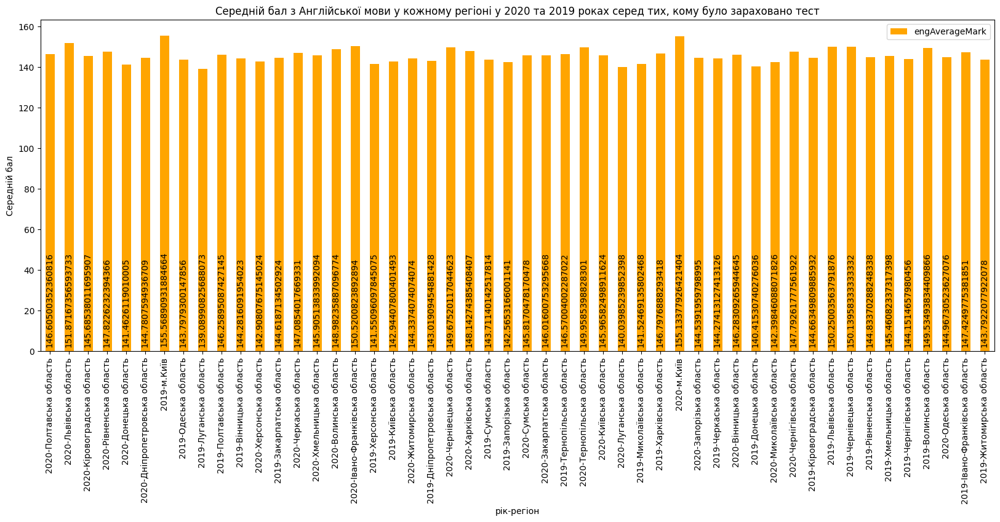

# Лабораторна робота №4 студента групи КМ-81 Горбача Костянтина

Перед виконанням програми додайте в папку проекту файли *Odata2019File.csv*, *Odata2020File.csv*

## Налаштування та запуск програми

Запустить MongoDB на комп'ютері та впишіть в файл [.env](./.env) (Linux/MacOS) або [env.bat](./env.bat)
(Windows) номер порту

Далі виконайте наступні команди:

* Linux/MacOS

```bash
python3 -m pip install virtualenv
python3 -m venv bd_env
source bd_env/bin/activate
source .env
python3 -m pip install -r requirements.dev
python3 main.py
```

* Windows

```bash
py -m pip install --user virtualenv
py -m venv bd_env
.\bd_env\Scripts\activate
env.bat
py -m pip install -r requirements.dev
py main.py
```

### Переривання та відновлення роботи

При перериванні з'єднання з базою (це можна викликати штучно виконавши команду `sudo systemctl stop mongod` а потім
`sudo systemctl start mongod` в окремому терміналі)
програма закінчує свою роботу, а при наступному її запуску з колекції LastRow беруться значення року та номер рядка, що
був записаний останнім, і продовжується запис починаючи з цього рядку. Також для підрахунку часу фактичного виконання
запису даних з файлу у базу з цієї таблиці береться значення часу, скільки виконувалась програма до "падіння".

__Наприклад__, програма виконувалась 10 хвилин, а тоді з'єднання з базою перервалося. Ми її перезапустили й вона
закінчила роботу за 20 хвилин. Тоді час виконання програми буде розрахований як 10 + 20 = 30 хв без урахування часу, що
пройшов між "падінням" і перезапуском програми.

### Запит

Завдання: `Варіант 14: Порівняти середній бал з Англійської мови у кожному регіоні у 2020 та 2019 роках серед тих кому було зараховано тест`
Програма виконує запит відповідно до завдання і записує результат у форматі _csv_ в файл
[resultFile.csv](./resultFile.csv). Результатом цього запиту є таблиця з трьома колонками:

- назва регіону
- рік
- середній бал з англійської мови

На основі цієї таблиці будується гістограма і зберігається в
файл [results_photo/AverageMarkByRegion.png](./results_photo/AverageMarkByRegion.png)

### Logs

Протягом усієї роботи програма записує свої дії у файл [database_logs.log](./database_logs.log). Також на початку і в
кінці запису даних фіксується час, тому останній запис у цьому файлі — час виконання запису усіх даних з файлів до
таблиць (див. приклад в пункті "Переривання та відновлення роботи")

## Результати виконання

### Таблиця та гістограма

```
year,region,engAverageMark
2020,Черкаська область,147.0854017669331
2019,Черкаська область,144.27413127413126
2019,м.Київ,155.56890931884664
2020,Рівненська область,147.8226232394366
2019,Івано-Франківська область,147.4249775381851
2019,Волинська область,149.53493834409866
2019,Вінницька область,144.2816091954023
...
```



### Logs example

Приклад логів при одному "падінні бази"

```
2021-05-16 20:05:11,048 INFO __main__::main: Start time 2021-05-16 20:05:11.048032
2021-05-16 20:05:11,049 INFO __main__::create_last_row_collection: Creating collections
2021-05-16 20:05:11,057 INFO __main__::insert_data: Inserting data from 0 row from file for 2019 year
2021-05-16 20:05:23,258 INFO __main__::insert_data_into_collections: Break time 2021-05-16 20:05:23.258154
2021-05-16 20:05:23,258 INFO __main__::insert_data_into_collections: Executing time 0:00:12.210122
2021-05-16 20:05:23,258 INFO __main__::insert_data_into_collections: Я упал: interrupted at shutdown, full error: {'ok': 0.0, 'errmsg': 'interrupted at shutdown', 'code': 11600, 'codeName': 'InterruptedAtShutdown'}
2021-05-16 20:05:42,653 INFO __main__::main: Start time 2021-05-16 20:05:42.653751
2021-05-16 20:05:42,655 INFO __main__::create_last_row_collection: Creating collections
2021-05-16 20:05:42,657 INFO __main__::insert_data: Inserting data from 65700 row from file for 2019 year
2021-05-16 20:06:39,595 INFO __main__::insert_data: Inserting from Odata2019File.csv is finished
2021-05-16 20:06:39,595 INFO __main__::insert_data: Inserting data from 0 row from file for 2020 year
2021-05-16 20:06:51,179 INFO __main__::insert_data_into_collections: Break time 2021-05-16 20:06:51.179881
2021-05-16 20:06:51,180 INFO __main__::insert_data_into_collections: Executing time 0:01:08.526130
2021-05-16 20:06:51,180 INFO __main__::insert_data_into_collections: Я упал: interrupted at shutdown, full error: {'ok': 0.0, 'errmsg': 'interrupted at shutdown', 'code': 11600, 'codeName': 'InterruptedAtShutdown'}
2021-05-16 20:07:23,064 INFO __main__::main: Start time 2021-05-16 20:07:23.064093
2021-05-16 20:07:23,065 INFO __main__::create_last_row_collection: Creating collections
2021-05-16 20:07:23,067 INFO __main__::insert_data: Inserting data from 44850 row from file for 2020 year
2021-05-16 20:08:29,490 INFO __main__::insert_data: Inserting from Odata2020File.csv is finished
2021-05-16 20:08:29,490 INFO __main__::main: End time 2021-05-16 20:08:29.490964
2021-05-16 20:08:29,491 INFO __main__::main: Inserting executing time 0:01:06.426871
2021-05-16 20:08:29,491 INFO __main__::get_user_query: Getting data for users query
2021-05-16 20:08:32,428 INFO __main__::get_user_query: Users query data recorded into resultFile.csv
2021-05-16 20:08:32,428 INFO __main__::build_plot: Building plot for data from resultFile.csv file
2021-05-16 20:08:33,517 INFO __main__::build_plot: Plot saved into results_photo/AverageMarkByRegion.png
2021-05-16 20:08:33,518 INFO __main__::main: Program is finished
2021-05-16 20:08:33,518 INFO __main__::main: Total inserting executing time 0:02:23.071305
```